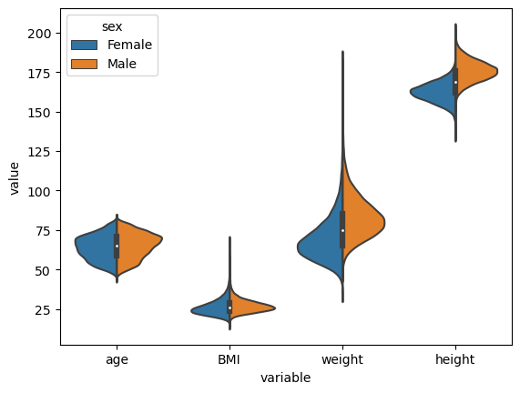
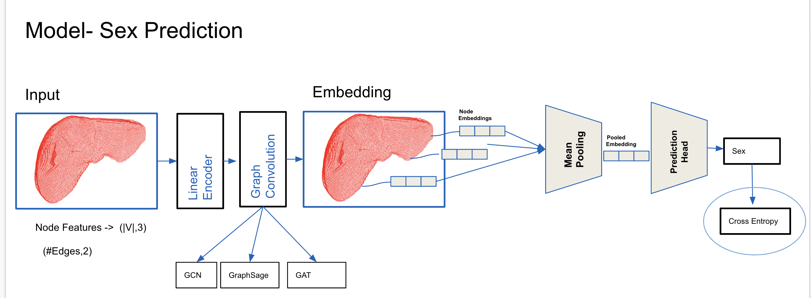
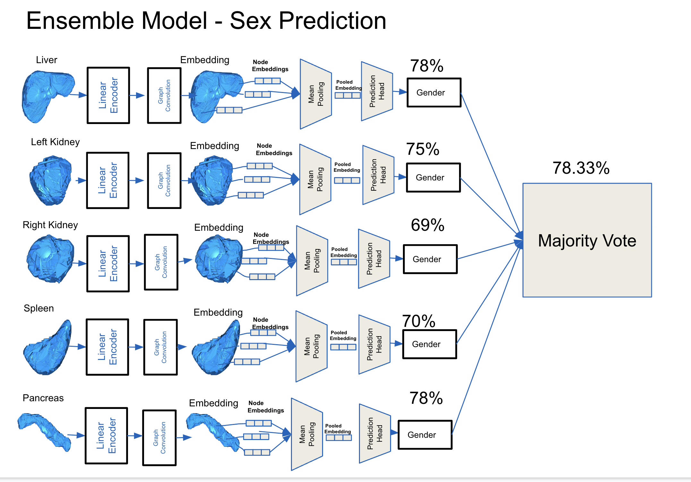
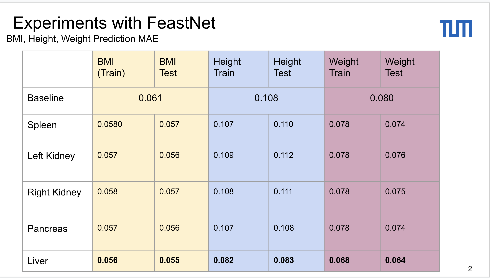
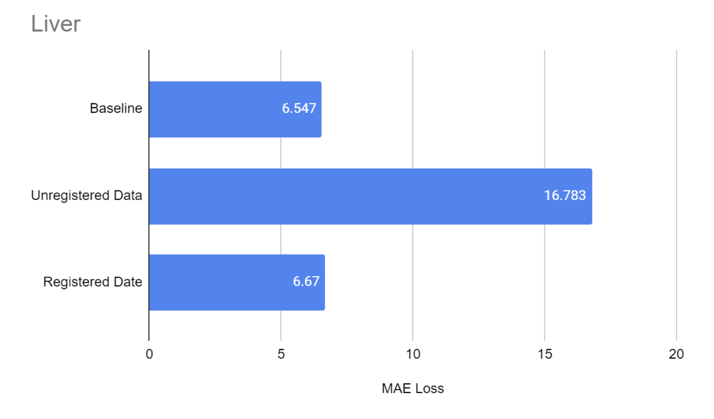
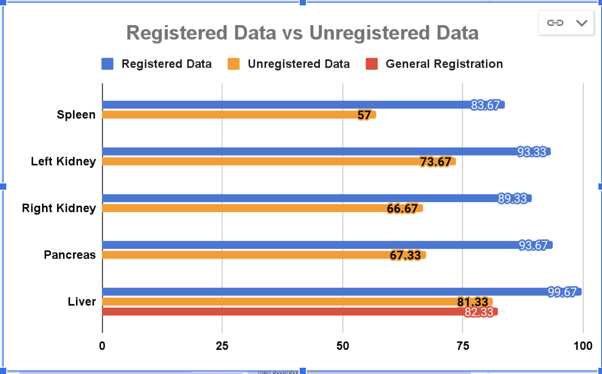

Graph Neural Networks on Abdominal Organs
==============================
TUM Advanced Deep Learning in Medicine Practical Course Project Repo
Group members: Caghan Koksal, Manu Puthiyadath, and Youssef Wally 

Explore performance of Graph Neural Networks on the organ mesh dataset on the downstream tasks
- Sex Classification
- Age Regression
- Weight Regression
- Height Regression
- BMI Regression

# Dataset
- A dataset of ~150K organ meshes extracted from MRI scans from the UKBioBank dataset.
Meshes 
- Liver
- Pancreas, 
- Kidneys
- Spleen.
- 30382 Patients.
- Features
-  Sex
-  Age
- BMI, 
- Height
- Weight.
Females: ~51%.
Males: ~49%.

Data statistics can be seen in the following figure


# Setup

To make it easy for you to get started with our model, here's a list of recommended next steps:

- [ ] Clone this repository into a local folder.
```

cd local/path
git clone https://gitlab.lrz.de/caghankoksal/organ-mesh-registration-and-property-prediction
```
- [ ] Setup the python virtual environement using `conda`.

```
module load python/anaconda3
cd environments 
conda env create -f open3d_model_env.yaml

```

# Model Architecture
We have used different 3 different graph convolutions.
- GCN
- GraphSAGE
- GAT 
<p> A simplified overview of our model architectures is given in the following figures :

### Baseline Sex Prediction Model:


### Ensemble Sex Prediction Model
All organ specific models are used and majority voting algorithm is used.



# Hyperparameter search with Wandb Sweeps
Initialize Sweep project from sweep_config.yaml file 
```
wandb sweep --project sweeps_mesh sweeps_config.yaml 
```
Set the gpu by using CUDA_VISIBLE_DEVICES and use the sweep_ID that is generated in previous command.
```
CUDA_VISIBLE_DEVICES=0 wandb agent sweep_ID
```

# Model Training
```
cd src/models
python train.py --model <MODEL> --task <TASK>  --batch_size <Batch Size> --device <GPU_NUMBER> --enc_feats <Enc Feat Dim> --  ...

```
Example:
To train Feastnet on age prediction with default parameters you can apply following command.
```
python train.py --model fsgnet --task age_prediction
```


# Results
For sex prediction we have used accuracy as an evaluation metric.
For regression tasks, mean average error is used as an evaluation metric.
<p> Our results given in the following figures :

### BMI, Weight, Height Regression Results :


### Age Regression Results :
Liver Age regression results
 Comparison between registered and unregistered data. 
Baseline is the mean prediction.

### Sex Classification Results :
Sex classification results.
Comparison between all organs. 




- [ ] Check the playground notebooks for usage examples

